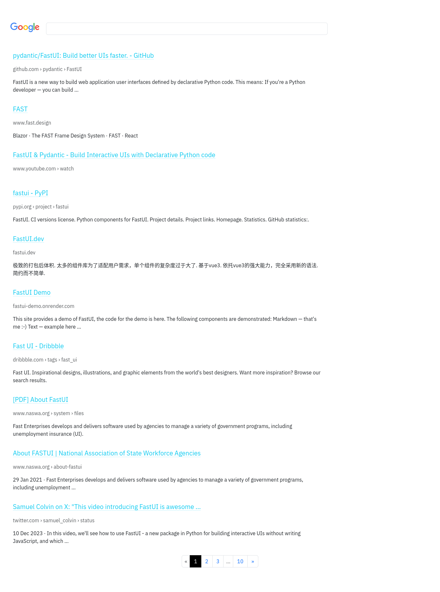

# Google Clone with FastUI

A simple Google clone test project for evaluating the [FastUI][fastui] library.

## Project Overview

This project is a basic implementation of a Google clone using the [FastUI][fastui] library. FastUI, created by [Samuel Colvin][samuel], provides a straightforward way to build user interfaces in Python.

## Screenshot

### Home Page

### Search Results Page

## Credits

- [FastUI][fastui] by [Samuel Colvin][samuel]
- [FastAPI][fastapi] by [Sebastián Ramírez][sebastián]
- [uvicorn][uvicorn] by [Encode][encode]
- [python-googlesearch][googlesearch] by [Anise][anise]
- Project initiated and maintained by [Md. Almas Ali][author].

## Author

Initiated and maintained by [Md. Almas Ali][author].

[author]: https://github.com/Almas-Ali/ "Md. Almas Ali"
[fastui]: https://github.com/pydantic/fastui/ "FastUI"
[samuel]: https://github.com/samuelcolvin/ "Samuel Colvin"
[fastapi]: https://github.com/tiangolo/fastapi/ "FastAPI"
[sebastián]: https://github.com/tiangolo/ "Sebastián Ramírez"
[uvicorn]: https://github.com/encode/uvicorn/ "uvicorn"
[encode]: https://github.com/encode/ "Encode"
[googlesearch]: https://github.com/Animenosekai/googlesearch/ "python-googlesearch"
[anise]: https://github.com/Animenosekai/ "Animenosekai"
